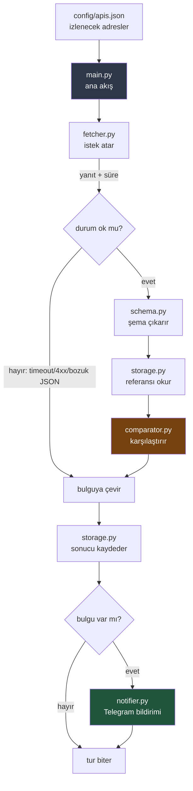
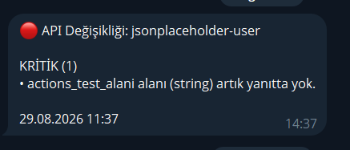

# API Contract Monitor

Bağımlı olduğunuz dış servislerin yanıt yapısı sessizce değiştiğinde, kullanıcınız fark etmeden önce sizi haberdar eden otomatik izleme sistemi.

  

**Somut olarak ne yapar:** İzlediğiniz bir servis `phone` alanını kaldırdığında ya da bir sayıyı metne çevirdiğinde, telefonunuza şu düşer:

```
🔴 API Değişikliği: jsonplaceholder-user

KRİTİK (2)
• phone alanı (string) artık yanıtta yok.
• plan.space alanının tipi integer iken string oldu.

BİLGİ (1)
• timezone alanı (string) yeni eklendi.

04.09.2026 15:32
```

Sistem GitHub'ın sunucularında kendi kendine çalışır — bilgisayarınızın açık olmasına gerek yoktur.

---

## Problem

Dış API'ler haber vermeden değişir: bir alan kaldırılır, bir tip değişir, bir uç nokta bozulur. Bu değişiklikler genelde ancak son kullanıcı şikayet ettiğinde fark edilir — yani en pahalı anda.

Sağlık kontrolü (health check) araçları bu sorunu çözmez: onlar servisin *ayakta olup olmadığına* bakar. Servis 200 döndürüyor ama yanıtın içindeki bir alan kaybolmuşsa, sağlık kontrolü yeşil yanmaya devam eder.

Bu sistem servisin **sözleşmesini** izler: dönen verinin yapısını.

---

## Nasıl çalışır

1. İzlenecek adresler bir yapılandırma dosyasında tanımlanır
2. Sistem her tur bu adreslere istek atar
3. Dönen JSON'dan bir **şema** çıkarır — alan adı → tip haritası
4. Bu şemayı daha önce kaydettiği referansla karşılaştırır
5. Bir sapma varsa bunu sınıflandırır (kritik / bilgi)
6. Sonucu veritabanına yazar
7. Kritik bir bulgu varsa Telegram'dan bildirim gönderir
8. Referansı günceller — ama **yalnızca gerçek bir değişiklik olduğunda**

İlk kez görülen bir adres için bulgu üretilmez; o tur yalnızca referans kaydedilir.

---

## Mimari



Modüller birbirini tanımaz; hepsini `main.py` çağırır. Bu sayede akışın tamamı tek dosyaya bakarak anlaşılır.

| Modül | Sorumluluğu |
|---|---|
| `fetcher.py` | Adrese istek atar; yanıtı, HTTP kodunu ve süreyi döndürür |
| `schema.py` | JSON'dan alan → tip haritası çıkarır (iç içe yapılar ve diziler dahil) |
| `comparator.py` | İki şemayı karşılaştırır, farkları bulgu listesine çevirir |
| `storage.py` | SQLite'a yazar/okur — veriye dokunan tek modül |
| `notifier.py` | Bulguları okunabilir mesaja çevirip Telegram'a gönderir |
| `main.py` | Hepsini sırayla çağıran ana akış; hata yönetiminin merkezi |
| `analyzer.py` | *(Henüz boş)* LLM ile yorumlama katmanı için ayrılmış |

---

## Tespit edilen değişiklik tipleri

| Tip | Ne demek | Önem |
|---|---|---|
| `field_removed` | Referansta olan alan artık yok | **Kritik** — uygulamayı kırar |
| `type_changed` | Alanın tipi değişti (sayı → metin gibi) | **Kritik** |
| `response_error` | Servis 4xx/5xx döndürdü veya ulaşılamadı | **Kritik** |
| `timeout` | Yanıt zamanında gelmedi | **Kritik** |
| `invalid_json` | Yanıt JSON olarak okunamadı | **Kritik** |
| `field_added` | Yeni alan eklendi | Bilgi |
| `slow_response` | Yanıt, geçmiş ortalamanın 3 katından yavaş | Bilgi |

İç içe yapılardaki değişiklikler yol bilgisiyle raporlanır: `plan.space`, `tags[].name` gibi.

---

## Kurulum

Aşağıdaki adımlar temiz bir klasöre klonlanarak fiilen sınanmıştır.

```bash
git clone https://github.com/SerhatAyyildiz/api-contract-monitor.git
cd api-contract-monitor

python -m venv venv
```

Sanal ortamı etkinleştirin:

```bash
# Windows (PowerShell)
venv\Scripts\Activate.ps1

# Windows (Git Bash)
source venv/Scripts/activate

# macOS / Linux
source venv/bin/activate
```

Bağımlılıkları kurun ve çalıştırın:

```bash
pip install -r requirements.txt

python -m pytest tests -q    # 77 test geçmeli
python -m src.main           # ilk kontrol turu
```

Beklenen çıktı:

```
[INFO] jsonplaceholder-user: değişiklik yok (289 ms).
[INFO] github-repo: değişiklik yok (487 ms).
[INFO] pypi-paket: değişiklik yok (243 ms).
[INFO] Tur bitti: 3 API, 3 başarılı, 0 hatalı.
```

> **Not:** Buraya kadar hiçbir API anahtarı gerekmez. Sistem `.env` dosyası olmadan da tam çalışır — kontrol yapar, karşılaştırır, kaydeder; yalnızca bildirim göndermez ve bunu sessizce geçer.

### Telegram bildirimi (isteğe bağlı)

Bildirim almak isterseniz:

1. Telegram'da [@BotFather](https://t.me/BotFather)'a `/newbot` yazıp bir bot oluşturun, verilen anahtarı alın
2. [@userinfobot](https://t.me/userinfobot)'a mesaj atıp kendi kimlik numaranızı öğrenin
3. Botunuza Telegram'dan bir kez `/start` yazın (yoksa bot size mesaj gönderemez)
4. `.env.example` dosyasını `.env` adıyla kopyalayıp değerleri doldurun:

```bash
cp .env.example .env
```

```
TELEGRAM_BOT_TOKEN=buraya_bot_anahtariniz
TELEGRAM_CHAT_ID=buraya_kimlik_numaraniz
```

`.env` dosyası `.gitignore` içindedir, depoya gitmez.

---

## Yapılandırma

İzlenecek adresler `config/apis.json` içinde tanımlanır:

```json
{
  "apis": [
    {
      "id": "github-repo",
      "name": "GitHub Depo Bilgisi (CPython)",
      "url": "https://api.github.com/repos/python/cpython",
      "method": "GET",
      "headers": {},
      "timeout": 15,
      "enabled": true
    }
  ]
}
```

| Alan | Ne işe yarar |
|---|---|
| `id` | Benzersiz kimlik; veritabanı kayıtları ve bildirimler bununla eşleşir |
| `name` | İnsan okusun diye açıklayıcı ad |
| `url` | İstek atılacak adres |
| `method` | HTTP metodu (varsayılan `GET`) |
| `headers` | Ek başlıklar; gerekmiyorsa boş nesne |
| `timeout` | Kaç saniye beklenecek (varsayılan 10) |
| `enabled` | `false` yapılırsa o adres atlanır, silmeye gerek kalmaz |

**Yeni adres eklemek** için listeye bir nesne daha eklemeniz yeterli — kod değişikliği gerekmez.

### Adres seçerken dikkat

Sistem **değerleri değil yapıyı** izler. Bu yüzden değeri sürekli değişen sayısal alanlar içeren adresler yanlış alarma yol açabilir: bir fiyat tam sayıyken ondalıklı hale gelirse sistem bunu `type_changed` sanar. Kur/fiyat/hava durumu gibi servisler bu yüzden dikkatli seçilmelidir.

### Ortam değişkenleri

| Değişken | Zorunlu mu | Ne için |
|---|---|---|
| `TELEGRAM_BOT_TOKEN` | Hayır | Bildirim göndermek için bot anahtarı |
| `TELEGRAM_CHAT_ID` | Hayır | Bildirimin gideceği hesap |
| `GEMINI_API_KEY` | Hayır | LLM yorumlama katmanı için ayrılmış *(katman henüz yazılmadı)* |

---

## Otomatik çalışma

`.github/workflows/monitor.yml` sistemi GitHub'ın sunucularında çalıştırır.

Kendi kopyanızda etkinleştirmek için: **Settings → Secrets and variables → Actions** bölümüne `TELEGRAM_BOT_TOKEN` ve `TELEGRAM_CHAT_ID` ekleyin. Ardından **Actions** sekmesinden **Run workflow** ile elle tetikleyebilirsiniz.

Her tur sonunda veritabanı depoya işlenir. Bu, sistemin hafızasının turlar arasında korunmasını sağlar — GitHub her çalıştırmada sıfırdan bir makine kurup sildiği için, veritabanı kalıcı olmasaydı sistem her turda her adresi "ilk kez görüyorum" sanar ve hiçbir değişikliği tespit edemezdi.

> **Dürüst not:** Zamanlayıcı saat başına ayarlıdır (`0 * * * *`), ancak GitHub ücretsiz hesaplarda zamanlanmış işleri yoğunluğa göre seyreltir. Ölçümlerimizde ~24 saatte beklenen 24 tur yerine 3 tur çalıştı. İzleme amacı için bu kabul edilebilir; atlanan turu bir sonraki tur yakalar. Kesin saatlik çalışma gerekiyorsa dış bir tetikleyici servis gerekir.

---

## Örnek bildirim

Aşağıda GitHub Actions üzerinden gönderilmiş gerçek bir bildirim yer alıyor. İzlenen servisten bir alan kaldırıldığında sistem bunu yakaladı ve bildirdi:



Bildirimin metin karşılığı:

```
🔴 API Değişikliği: jsonplaceholder-user

KRİTİK (1)
• actions_test_alani alanı (string) artık yanıtta yok.

29.08.2026 11:37
```

Kritik bulgu varsa başlık 🔴, yalnızca bilgi amaçlı bulgu varsa 🟡 olur. Böylece bildirime bakar bakmaz aciliyeti anlaşılır.

Mesaj formatı bilinçli olarak düz metindir. Alan adlarında `_` ve `[]` karakterleri geçtiği için Markdown/HTML biçimlendirme kullanılmaz — kullanılsaydı `plan_id` gibi bir alan adı mesajı bozardı.

---

## Testler

```bash
python -m pytest tests -q
```

| Dosya | Test sayısı | Kapsamı |
|---|---|---|
| `test_main.py` | 33 | Ana akış, hata durumları, adres gizleme |
| `test_comparator.py` | 15 | Şema karşılaştırma, iç içe yapılar, diziler |
| `test_notifier.py` | 12 | Mesaj biçimlendirme, ayar eksikliği, anahtar gizleme |
| `test_storage.py` | 11 | Veritabanı yazma/okuma, yanıt süresi ortalaması |
| `test_fetcher.py` | 6 | Yapılandırma okuma dayanıklılığı |
| **Toplam** | **77** | |

Testler gerçek ağ isteği veya gerçek Telegram çağrısı yapmaz.

---

## Proje yapısı

```
api-contract-monitor/
├── .github/workflows/monitor.yml   # Saatlik zamanlayıcı
├── config/apis.json                # İzlenecek adresler
├── data/monitor.db                 # SQLite veritabanı (sistemin hafızası)
├── src/
│   ├── fetcher.py                  # İstek atar
│   ├── schema.py                   # Şema çıkarır
│   ├── comparator.py               # Karşılaştırır
│   ├── storage.py                  # Kaydeder/okur
│   ├── notifier.py                 # Bildirir
│   ├── analyzer.py                 # (boş) LLM katmanı için ayrıldı
│   └── main.py                     # Ana akış
├── tests/                          # 77 otomatik test
├── .env.example                    # Örnek sır dosyası
└── requirements.txt
```

---

## Güvenlik

- Anahtarlar hiçbir zaman koda yazılmaz; `.env` veya GitHub Secrets üzerinden okunur
- `.env` ve sanal ortam `.gitignore` içindedir
- Telegram API adresi anahtarı içinde taşıdığı için hata mesajları temizlenir; anahtar `<gizlendi>` ile değiştirilir
- Ağ hatalarında servis adresleri loglara ve bildirimlere sızmasın diye maskelenir — adres bir erişim anahtarı taşıyabilir

---

## Bilinen sınırlar

Dürüst olmak gerekirse, şu anda şunlar eksik:

- **`slow_response` eşiği hızlı servislerde yanlış alarm üretiyor** — eşik "geçmiş ortalamanın 3 katı" olarak sabittir. Ortalaması ~100 ms olan hızlı bir servis 300 ms'de yanıt verdiğinde bu eşik aşılır, oysa bu tamamen normal bir ağ dalgalanmasıdır. Gerçek kullanımda bu şekilde iki gereksiz bildirim üretildi. Mutlak bir alt sınır (örneğin "1 saniyenin altındaki yanıtlar hiç yavaş sayılmasın") eklenmesi gerekiyor
- **Zamanlayıcı seyrek çalışıyor** — yukarıda açıklandı; GitHub'ın ücretsiz kademe davranışı
- **Her tur depoya bir kayıt bırakıyor** — kontrol geçmişi her turda büyüdüğü için veritabanı her seferinde değişir; depo zamanla otomatik kayıtlarla dolar
- **LLM yorumlama katmanı yazılmadı** — `analyzer.py` şu an boş; bulgular ham haliyle bildiriliyor
- **Kimlik doğrulaması gereken adresler denenmedi** — yapı destekliyor (`headers` alanı var) ama gerçek bir anahtarlı servisle sınanmadı
- **Hata metinlerinde çok uç bir durumda** öneksiz bir sunucu adı maskelenmeden kalabilir; gerçek akışta oluşmuyor

---

## Teknolojiler

Python 3.11+ · SQLite (standart kütüphane) · GitHub Actions · Telegram Bot API · `requests` · `pytest`
